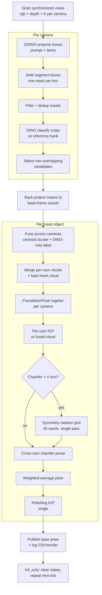
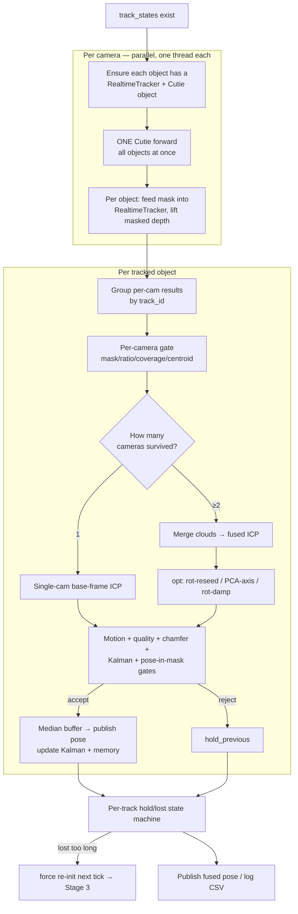

# Pipeline Walkthrough — init and tracking

This document explains the perception pipeline **step by step**. It is
in two halves:

- **Stages 0–4 — Init** (`launch_pipeline.sh baseline`, i.e. `init_only` mode):
  from process start to "init done".
- **Stage 5 — Tracking** (`launch_pipeline.sh fast-track` / `accurate-track`,
  i.e. `track` mode): what happens once objects are initialized and the node
  switches from re-detecting every tick to Cutie-based fused tracking.

```bash
scripts/launch_pipeline.sh baseline         # init only (Stages 0–4)
scripts/launch_pipeline.sh fast-track       # init once, then track (Stage 5)
scripts/launch_pipeline.sh accurate-track   # same, with the settled-axis extras
```

The baseline runs in **`init_only` mode**: every tick re-runs the full GDINO → SAM
→ DINO → fusion → FoundationPose → ICP pipeline from scratch. The ICP
refinements per object are (a) one per-camera ICP, (b) one *conditional* symmetry
rotation grid (single pass, runs only when Chamfer is too high), and (c) one
polishing ICP on the averaged pose. 

In **`track` mode** the *first* tick (or any re-detect) is exactly this init path;
the difference is that init's per-object states are **kept** instead of cleared, so
every subsequent tick takes the much cheaper tracking path (Stage 5) until a track
is lost and a re-init is forced.

Code entry point: [run_pipeline_track_multicam.py](../src/perception/ros/learn_runners/run_pipeline_track_multicam.py)

---

## Pipeline diagram (per tick — Stage 2 onward)

Stages 0–1 below (launch + one-time model loading) happen once at startup and are
**not** part of the loop. The actual per-frame pipeline is everything from
"grab views" onward:



---

## Baseline configuration (what the launch file pins)

From [scripts/launch_pipeline.sh](../scripts/launch_pipeline.sh):

| Setting | Value | Meaning |
|---|---|---|
| `--num-cameras` | `3` | `zed2i_1`, `zed2i_2`, `zed2i_3` |
| `--mask-source` | `gdino_sam` | GDINO proposes boxes → SAM segments them |
| `--gdino-device` | `cpu` | Grounding-DINO runs on CPU (keeps GPU VRAM for SAM/FP) |
| `--gdino-box-threshold` | `0.30` | box-confidence cutoff |
| `--gdino-text-threshold` | `0.20` | text-token cutoff |
| `--gdino-max-boxes` | `20` | max box proposals per image |
| GDINO prompt | `items` | class-agnostic MUSE-style prompt (not the per-class names) |
| `--sam-max-image-side` | `1536` | SAM input downscaled to ≤1536 px |
| `--reference-source` | `real` | DINO reference bank built from `Data/ZED_screens` |
| `--dino-min-crop-side` | `112` | tiny crops bicubic-upscaled before DINO |
| `--icp-grid-n-rot` | `45` | rotation seeds in the symmetry grid |
| `--icp-grid-prescreen` | on | cheap raw-Chamfer reject before each grid ICP |
| `--icp-grid-cross-cam-chamfer` | on | grid scored by mean Chamfer across per-cam clouds |
| `--fusion-match-max-centroid-dist-m` | `0.07` | cross-cam fuse if base-frame centroids within 7 cm |
| `--depth-fill-holes-kernel` | `3` | fill depth holes inside each mask (3×3) |
| `--icp-variant` | `point_to_point` | ICP cost function |
| `--run-mode` | `init_only` | re-detect every tick; never enter tracking |

---

## Stage 0 — Launch

1. `scripts/launch_pipeline.sh baseline` restarts the docker container
   `vision` (override with `CONTAINER=…`), sources ROS + the venv, and launches
   `python3 -m src.perception.ros.learn_runners.run_pipeline_track_multicam`
   with the baseline arg list, teeing output to
   `outputs/logs/multicam_init_final_baseline.log`.
2. `main()` parses args, loads camera extrinsics into a `T_base_cam` map (one
   4×4 per camera), constructs the `MultiCamGrabber` (ROS subscriptions), and
   spins up the `FoundationPoseTrackerNode`.

## Stage 1 — Node construction (one-time model loading)

`FoundationPoseTrackerNode.__init__` loads every heavy model **once**:

1. **Camera set** = first 3 of `ALL_CAMERAS`; **mesh map** from `--cad-dir`
   (`Data/CAD_Models_centered`): `object_id → mesh path`; **per-camera SAM filter
   params** from the `cam{N}-*` args.
2. **DINO reference bank** — a `DINOIdentifier` (`dinov2_vitg14`) embeds the real
   reference images (`Data/ZED_screens`) for every object into an in-memory bank.
   This is what each candidate crop is later classified against.
3. **One shared SAM2 model** (`sam2.1_hiera_base_plus`, bf16) is built and warmed
   up. A single model serves all 3 cameras; per-camera area/bbox filters are
   re-applied downstream.
4. **Grounding-DINO proposer** (`grounding-dino-base`) on **CPU** with prompt
   string `items.`; weights are eagerly preloaded so the first cycle runs on a
   settled GPU.
5. **One shared FoundationPose wrapper** (one estimator, one nvdiffrast CUDA
   context, one GPU worker thread); the first mesh is pre-cached.
6. A ROS **timer** at `--timer-period-s = 0.05 s` fires `_tick`.

## Stage 2 — Per-tick dispatch (`_tick`)

Every 0.05 s (the timer re-fires immediately; a tick still in flight is skipped
via `self.busy`, so the effective rate is whatever a full cycle costs):

1. If a previous tick is still running (`self.busy`) → skip.
2. `grabber.get_latest_views()` returns a time-synchronized list of `View`
   objects, one per camera, each carrying `rgb`, `depth`, and intrinsics `K`.
   If not all cameras are ready → return.
3. **Branch — init vs track.** `_tick` looks at whether any camera already has
   live track states (all in `track`/`track/rt`/`degraded`/`fast_recovery` mode):
   - **No live states** (or a forced re-init was requested) → **init branch**:
     `torch.cuda.empty_cache()` then `_process_multicam_init(views, stamp)`
     (Stage 3).
   - **Live states present** → **tracking branch**: `_track_multicam_fused(views,
     stamp)` (Stage 5).
4. In `init_only`, init clears its states at the end of every tick (Phase 4), so
   the branch in step 3 always resolves to init — the tracking path is never
   reached. In `track` mode the states persist, so only the first tick inits and
   every later tick tracks.

---

## Stage 3 — `_process_multicam_init` (the actual pipeline)

### Phase 1 — Per-camera SAM + DINO

Looping over each camera's view:

**3.1 Mask generation — `_generate_and_filter_masks(rgb, cam_id)`**

1. Log free VRAM (mask collapse correlates with low headroom).
2. **GDINO proposal** — `gdino_proposer.propose(rgb)`:
   - The image + the `items.` prompt run through Grounding-DINO.
   - Boxes above the box/text thresholds are kept, sorted by score, capped at
     `--gdino-max-boxes (20)`.
   - Output: `(bbox_xyxy, score, label)` proposals; `_last_sam_n_boxes` records
     how many boxes SAM is about to receive (for the dead-init guard).
3. **SAM segmentation** — `sam.generate_from_boxes(rgb, boxes, box_scores)`:
   - SAM2 takes the GDINO boxes as prompts and returns **one mask per box**.
     `set_image()` encodes the (≤1536 px) image once; each box → `predict()`.
   - **Collapse recovery**: if every box's mask falls below min-area at once (a
     bf16 cold-start glitch, not an empty scene), it re-encodes in bf16, then
     falls back to fp32 for the frame; if still collapsed, that camera is skipped
     for this cycle (recovers next cycle).
4. **Mask filtering** (per camera): drop masks below `min_mask_area` /
   `min_bbox_side_px`; reject too-large masks; reject border-touching masks;
   reject masks whose centroid is outside the ROI; sort by area; **dedup by bbox
   IoU** (`--mask-dedup-iou`).
   Output: a list of `SAMMaskCandidate` (mask, bbox, area, SAM score, and the
   GDINO box score carried as `prompt_score`).

**3.2 DINO classification — `_classify_masks_batched(rgb, masks, …)`**

1. For each mask, bbox-crop the RGB and the local mask; **upscale** any crop whose
   short side < 112 px (`--dino-min-crop-side`) so DINOv2's resize doesn't throw
   away detail.
2. **Batched embedding** — all crops go through one DINOv2 forward. Each crop
   yields a **two-stream MUSE embedding**: L2-normed CLS token + L2-normed
   GeM-pooled patch tokens (`gem_p = 1.5`).
3. **Classify each embedding** against the reference bank → `scores_by_object`,
   using the GDINO box score as an **objectness prior**.

   The exact MUSE-style scoring implemented in
   [`dino_identifier.py`](../src/perception/learned/DINO/dino_identifier.py) is:

   For a crop, DINOv2 returns one CLS token `c` and patch tokens
   `{p_i}_{i=1..N}`. The patch stream is GeM-pooled with exponent `p = 1.5`
   and `eps = 1e-6`:

   ```text
   g = (mean_i max(p_i, eps)^p)^(1/p)
   q_cls   = c / ||c||_2
   q_patch = g / ||g||_2
   q       = [q_cls, q_patch]              # shape (2, D)
   ```

   Each reference image is embedded the same way. For query stream `q` and
   reference stream `r`, similarity is Tanimoto:

   ```text
   T(q, r) = <q, r> / max(||q||_2^2 + ||r||_2^2 - <q, r>, 1e-12)
   ```

   The two streams are blended per reference `j` (MUSE Eq. 4 in the code) with
   `alpha = MUSE_STREAM_ALPHA = 0.5`:

   ```text
   s_j = alpha * T(q_cls, r_j_cls)
       + (1 - alpha) * T(q_patch, r_j_patch)
   ```

   Per object/class `k`, references belonging to that object are reduced by
   mean top-3 similarity (`top_k = 3`):

   ```text
   a_k = mean(top_3({s_j | object_id(j) = k}))
   ```

   With at least two classes, the pipeline then computes the relative softmax
   score and joint score (MUSE Eq. 5/6 in the code) with
   `tau = MUSE_TAU = 0.02`, and blends absolute + relative scores with
   `beta = MUSE_JOINT_SCORE_ALPHA = 0.8`:

   ```text
   z_k   = a_k / tau - max_m(a_m / tau)
   rel_k = exp(z_k) / (sum_m exp(z_m) + 1e-12)
   j_k   = beta * a_k + (1 - beta) * rel_k
   ```

   Finally, the scalar GDINO proposal score `p_obj` (`prompt_score`) is applied
   as the MUSE objectness prior (MUSE Eq. 8/10 in the code) with
   `gamma = MUSE_OBJECTNESS_PRIOR_GAMMA = 0.1`:

   ```text
   score_k = j_k * max(0, p_obj)^gamma
   ```

   `scores_by_object` is this `{object_id: score_k}` map. Because the current
   prior is scalar per proposal, it scales all classes equally, so it changes the
   absolute score used by thresholds but not the top-class ordering for that crop.
4. **Decision**: take top-1 and top-2, compute `margin = top1 − top2`. Mark
   `"unknown"` unless `top1 ≥ --dino-min-score (0.50)` **and**
   `margin ≥ --dino-min-margin (0.05)` (small bboxes < 5000 px use looser
   thresholds: score ≥ 0.40, margin ≥ 0.025).
5. **Final score**: `class_score − area_penalty·area_ratio + fill_ratio_weight·fill_ratio`;
   candidates sorted by it descending.

**3.3 Candidate selection — `_select_top_candidates(ranked, depth)`**

Greedily keep a candidate if it is not `"unknown"`, overlaps already-selected
masks by ≤ 15 %, has depth coverage ≥ `--min-depth-coverage (0.50)`, and we are
under `--max-objects (15)`. Result per camera: a short list of `CandidateSelection`.

**Dead-init guard**: if GDINO proposed ≥ 3 boxes but SAM returned **0 masks on all
cameras** for 2 consecutive cycles, the SAM session is judged unrecoverable and
the process exits with code **42** so the supervisor relaunches it.

If no camera produced any selection → clear states and return.

### Phase 2 — Cross-camera fusion (`run_multicam_fusion`)

1. **`build_per_cam_detections`**: back-project each selected mask's depth into the
   **base frame** using `K` and `T_base_cam`, giving a 3D cloud + centroid per
   detection.
2. **`match_detections_across_cameras`**: geometry-first **incremental
   clustering** — cameras folded in one at a time, each detection joins the
   nearest cluster whose centroid is within the gate
   (`--fusion-match-max-centroid-dist-m = 0.07 m`, widened adaptively for large
   objects by cloud diagonal). Each cluster holds at most one detection per
   camera; ambiguous detections are dropped.
3. **Label arbitration**: within each cluster the class is decided by **summed
   DINO-score voting**, and that winning `object_id` is written onto every member.
4. Output: a list of `FusedDetection` (one physical object + its per-camera
   detections).

### Phase 3 — Per-object pose (FP + ICP)

For each `FusedDetection`:

**3a. Lift & merge clouds**
- For every contributing camera: **fill depth holes** inside the mask
  (`--depth-fill-holes-kernel 3`), then `lift_masked_depth_to_base` (voxel 1 mm)
  into the base frame.
- **Merge** the per-cam clouds (voxel 1 mm) into one `fused_cloud`; skip if < 50
  points. Load the mesh as a 5000-point `model_pcd`.

**3b. Per-camera FoundationPose + ICP** — for each contributing camera:
1. **One FoundationPose call** — `estimate_pose(rgb, depth, K, mask)` runs
   `est.register(..., iteration=0)` and returns `T_object_camera` (single
   register, not iterated).
2. **Pose sanity** (`_pose_reason`): reject flipped orientation / out-of-range
   translation.
3. Convert to base frame: `T_base = T_base_cam · T_cam`.
4. **Per-camera ICP** — `run_icp_in_base_frame(fused_cloud, model_pcd, T_base,
   max_corr = 0.05, 30 iters)` → `T_refined`, `fitness`, `rmse`. Reject if
   `fitness < 0.10`.
5. **Chamfer** distance model→cloud at `T_refined`.
6. **Symmetry rotation grid — single, conditional** (`_icp_rotation_grid`), run
   **only if** `Chamfer > --icp-grid-skip-chamfer-m (0.004 m)`:
   - 45 deterministic SO(3) seed rotations (identity first) at the current
     translation.
   - **Prescreen** each seed by raw Chamfer; skip seeds above
     `--icp-grid-prescreen-tau (0.04)`.
   - ICP-refine each surviving seed; drop `fitness < 0.10`.
   - **Score** by mean Chamfer across the per-cam clouds and keep the lowest.
   - If the grid pose beats the current Chamfer, adopt it and recompute
     `fitness`/`rmse`. (The grid runs once — there is no jitter "second pass".)
7. **Chamfer accept/uncertain**: accept; if `Chamfer > CHAMFER_REJECT_M` (0.012
   single-cam / 0.015 multi-cam) tag `init_quality = uncertain` and count a
   consecutive failure (3 fails ⇒ schedule a full SAM+DINO reinit of that object
   next cycle).
8. Append this camera's pose as a candidate with weight `fitness / (Chamfer + ε)`.

**3c. Cross-camera chamfer pruning**: with ≥ 2 candidates, hard-reject any camera
whose Chamfer > 2× the best.

**3d. Weighted average** — `weighted_average_poses` combines the surviving
per-camera poses into one canonical base-frame pose.

**3e. Polishing ICP — single, final** — `run_icp_in_base_frame(fused_cloud,
model_pcd, T_canonical, max_corr = 0.03, 20 iters)` snaps the averaged pose back
onto the fused cloud. This is the last refinement.

**3f. Publish & register state**
- Allocate (or reuse) a `track_id`.
- Back-project the canonical base pose into each contributing camera frame
  (`T_cam_base · T_canonical`), sanity-check it, and build an `ObjectTrackState`
  per camera.
- Publish the canonical pose as a `PoseStamped` on
  `/perception/fp/pose_base/fused/<track_id>` (base frame); log `INIT` lines.

### Phase 4 — Finalize the tick

1. NMS by 3D position to drop duplicate states.
2. **Store the per-camera `ObjectTrackState`s** — but the mode decides what
   "store" means:
   - `run_mode == init_only` → `track_states` is reset to **empty**, so the next
     tick redoes the entire pipeline from Phase 1.
   - `run_mode == track` → the states are **kept** (each with `mode="track"`, the
     canonical pose as `T_object_camera`, and the SAM mask saved as
     `recovery_mask`). This is the seed Stage 5 tracking picks up next tick.
3. `_reset_tracking_state_for_reinit` clears the per-track warmup counters, median
   buffers, and Kalman filters so tracking starts clean for the new states.
4. `torch.cuda.empty_cache()` and log the total init time + object count.

---

## "Init done" — what you have at the end

For every detected object:
- a **canonical 6-DoF pose in the base frame**, published on
  `/perception/fp/pose_base/fused/<track_id>`,
- Chamfer/fitness diagnostics in the logs,
- CSV rows in `init_pose_log.csv`, plus a render under `init_renders/`,
- in `track` mode, a persisted `ObjectTrackState` per camera (pose + recovery
  mask) that hands the object off to Stage 5.

---

## Stage 5 — Tracking mode (`track`)

Once init has stored states, every later tick takes `_track_multicam_fused`
instead of the full detect→pose pipeline. The expensive learned front-end (GDINO,
SAM, DINO, FoundationPose) is **gone from the hot loop**. Each frame now does only:
**Cutie mask propagation → masked-depth point clouds → one fused ICP per object →
a stack of gates → publish or hold**. This is what makes tracking run at many Hz
where init runs takes 50s on the current hardware.

### What carries the pose between frames

There is **no FoundationPose in tracking**. The pose is propagated purely by ICP of
the live depth cloud against the CAD model, seeded from the previous frame's pose.
The job of every gate below is to decide whether this frame's ICP result is
trustworthy enough to publish, or whether to **hold** the last good pose.

### Tracking diagram (per tick)



### Tracking presets (what the launch file pins)

Both tracking presets start from `TRACK_BASE_ARGS` in
[scripts/launch_pipeline.sh](../scripts/launch_pipeline.sh) (which sets
`--run-mode track --tracking-profile fast_cutie`). The profile and the extra flags
are the only difference between them:

| Preset | Adds on top of the fast base | Use it for |
|---|---|---|
| `fast-track` | nothing — just the fast base + pose logging | following medium-to-fast motion (~1 m/s); rotation about the screw axis is loosely held |
| `accurate-track` | rotation slew-limit + low-pass, chamfer-triggered **rot-reseed**, cautious **PCA shaft-axis** snap | a settled object where you want a better screw-axis estimate (angular error mostly < ~20°) |

Key base-profile choices (`fast_cutie` + the launch base args):
`--track-icp-num-points 800` and `--fused-track-icp-max-iteration 8` keep ICP
cheap; the fused Kalman and the
axis-dominant jump gate are **disabled**; motion gates are widened
(`--fused-track-max-translation-speed-mps 1.2`, `--fused-track-max-rotation-speed-degps 1200`);
centroid recovery is **on** so a fast mask jump re-seeds ICP instead of dropping
the track.

### Stage 5.1 — Per-camera Cutie + cloud lift (`_run_one_camera`)

Cameras run **in parallel** (one `ThreadPoolExecutor` worker each) so a third
camera overlaps instead of serializing. Each camera owns its own Cutie session and
its own `RealtimeTracker`s (thread-safe). Per camera:

1. **Pass 1 — register objects.** For each state, ensure there is a
   `RealtimeTracker` (keyed `cam_id_track_id`) holding the per-object pose/ICP
   state, and that the object is registered in the shared per-camera **Cutie**
   session (seeded from `recovery_mask` at init, or re-seeded from
   `last_good_mask` if the session dropped it). Objects no longer present on the
   camera are removed from the session so Cutie stops segmenting stale objects.
2. **One Cutie forward for the whole camera** — `session.track_multi(rgb)` returns
   `{track_id: mask}` for **all** objects in a single pass (not one forward per
   object). This is the bulk of per-camera latency.
3. **Pass 2 — per object**: feed each object's Cutie mask into its
   `RealtimeTracker.track_with_mask(...)`. With `--skip-per-cam-icp-tracking` (on
   by default) the per-camera ICP is skipped here — the mask is what matters; the
   real pose refinement is the fused ICP downstream. If Cutie returned no mask for
   an object, its state goes `mode="degraded"` and `lost_count += 1`.

The masked depth for each surviving object is later lifted to the base frame
(voxel 1 mm) by the per-camera gate (Stage 5.3), giving one point cloud per
(camera, object).

### Stage 5.2 — Group by track

All per-camera results are grouped **by `track_id`** (per physical instance), not
by `object_id` (class), so N same-class objects stay distinct. Every currently
tracked `track_id` is processed below even if **no** camera produced a usable mask
this tick (it will fall through to `hold_previous`).

### Stage 5.3 — Per-camera gate (`_evaluate_fused_camera_candidate`)

For each (camera, object) the gate builds the masked-depth cloud and rejects bad
contributors **before** they can corrupt the fused cloud. In order, a camera is
dropped if: the RealtimeTracker result is invalid; mask area too small; mask area
changed too much vs the last good mask (`--fused-gate-min/max-mask-area-ratio`);
depth coverage too low; lifted cloud too small (`--fused-gate-min-cloud-points`);
or the cloud centroid is too far from the previous pose
(`--fused-gate-max-centroid-dist-m`). During the **warmup** window
(`--fused-track-warmup-frames`, the first few frames after init) these thresholds
are relaxed and the centroid check is skipped, because the init→track handoff
legitimately shifts things.

### Stage 5.4 — Fuse + ICP

Survivors are split by camera count:

- **Single camera** (`unique_survivor_cams == 1`): run one base-frame ICP of that
  camera's cloud against the model, seeded from the previous pose (or the centroid
  recovery seed). Mode tag `single_cam_fallback`.
- **Two or more cameras**: merge the survivor clouds (voxel 1 mm; optionally
  distance-weighted with `--use-weighted-cloud-merge`) into one fused cloud, then
  run **one fused ICP** against the model seeded from the previous pose. Mode tag
  `fusion` / `fusion_2cam`.

**Optional rotation fixes** (all opt-in, all no-ops unless their flag is set, so
`fast-track` skips them and `accurate-track` enables them — run in this order on
the fused result):
1. **Rot-reseed** (`--fused-track-rot-reseed`): if the post-ICP grid-chamfer says
   the shaft axis is wrong but the object isn't fully lost, re-run the init-style
   rotation grid around the *current translation* and keep it only if it lowers
   chamfer. Fixes a wrong-axis local minimum that ICP alone can't escape.
2. **PCA shaft-axis snap** (`--fused-track-pca-axis`): for an elongated
   (shaft-like) cloud, snap the pose's shaft axis onto the cloud's principal axis
   — a global, ICP-free axis estimate — keeping the (harmless) spin about the
   shaft. Only applied when the ICP-vs-PCA disagreement is within a sane window.
3. **Rotation damping** (`--fused-track-rot-slew-limit-deg` /
   `--fused-track-rot-lowpass`): *clamp* (never reject) how far the orientation may
   turn per frame and low-pass it toward the previous orientation, to stop fused
   ICP from walking the weakly-observable shaft axis away from a good init.
   Translation is left untouched so fast motion still tracks.

> **Why these exist:** the thin, symmetric screws' shaft-axis *direction* is only
> weakly observable from depth (a near-flat chamfer landscape), so plain fused ICP
> can drift the orientation. These three are the `accurate-track` tools for that;
> see the project notes on rotation-axis observability.

### Stage 5.5 — Accept / hold gates

The candidate pose then passes a stack of gates (skipped or relaxed during
warmup). Translation/rotation **jump** gates are **motion-scaled**: the per-frame
limit is `max_speed · dt` (clamped), so faster real motion is allowed more jump.
Gates, any of which can reject:
- **fitness / RMSE** of the ICP (`--fused-track-min-fused-icp-fitness`,
  `--fused-track-max-fused-icp-rmse-m`),
- **jump** in translation and rotation vs the motion-scaled thresholds,
- **chamfer** distance model→cloud (`--fused-track-max-chamfer-m`) — computed only
  when the pose isn't already clean and only every `--chamfer-every-n-frames`,
- **axis-dominant jump** gate (disabled in the fast profile),
- **Kalman soft-reject** (disabled in the fast profile): reject if the pose is far
  from the translation-Kalman prediction *and* ICP fitness is weak,
- **pose-origin-in-mask** (`--track-require-pose-origin-in-mask`): the projected
  object origin must fall inside the Cutie mask (± `--track-pose-mask-margin-px`).

**Jump rescue:** if the *only* failures are the motion-jump gates but the pose
otherwise fits the cloud well (good fitness/RMSE and a tight chamfer), the frame is
accepted anyway and tagged `fusion_rescued` — this is what lets the tracker follow
genuinely fast motion without dropping.

On **accept**: push the pose through the median buffer
(`--median-pose-buffer-size`, =1 in the fast profile = off), publish, update the
Kalman filter and the per-track memory (last pose + timestamp + cloud centroid),
and write the pose back into each surviving camera's state and RealtimeTracker. On
**reject**: the decision becomes `hold_previous`.

### Stage 5.6 — Hold / lost state machine

Each track carries a `lost_count` driving a `pose_status`:
- **accepted** → `lost_count = 0`, status `fresh`.
- **rejected / no survivors** → `lost_count += 1`:
  - `≤ --fused-track-hold-window-frames` → status `held` — the **last good pose is
    still published** (from memory) so consumers see continuity through a brief
    dropout.
  - up to `--fused-track-max-lost-frames` → status `stale` (no pose published).
  - beyond that → status `lost`: the track is queued in `_force_reinit_tracks`.

On the next tick the lost track's states are dropped from every camera. If no
survivors remain, or `--reinit-lost-tracks-while-tracking` is set, the tick runs
the full **Stage 3** init. By default a partial loss keeps tracking the survivors
without a global re-init on that tick.

### Stage 5.7 — Output

Same topics as init: per object a base-frame `PoseStamped` on
`/perception/fp/pose_base/fused/<track_id>` (published on accept, or from memory
while `held`). With `--log-track-poses` a compact per-tick CSV row (pose
quaternion + metrics) is written to `--track-pose-log-path`
(`outputs/logs/live_fast_track_q.csv` / `live_accurate_track_q.csv`). A `[STAGE]`
latency line (percam / icp / post split) is printed every 20 ticks regardless of
the debug flags, so the tracking loop can be profiled with logging off.
