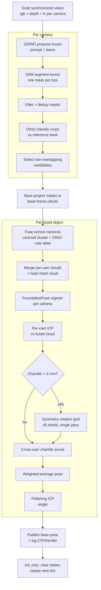

# Pipeline Walkthrough — `launch_pipeline.sh baseline` (init-only)

This document explains the perception pipeline **micro-step by micro-step, from
process start to "init done"**, as it runs under the locked baseline:

```bash
scripts/launch_pipeline.sh baseline
```

The baseline runs in **`init_only` mode**: every tick re-runs the full GDINO → SAM
→ DINO → fusion → FoundationPose → ICP pipeline from scratch. The only ICP
refinements per object are (a) one per-camera ICP, (b) one *conditional* symmetry
rotation grid (single pass, runs only when Chamfer is too high), and (c) one
polishing ICP on the averaged pose. **There is no second ICP pass beyond these.**

Code entry point: [run_pipeline_track_multicam.py](../src/perception/ros/learn_runners/run_pipeline_track_multicam.py)

---

## Pipeline diagram (per tick — Stage 2 onward)

Stages 0–1 below (launch + one-time model loading) happen once at startup and are
**not** part of the loop. The actual per-frame pipeline is everything from
"grab views" onward:



---

## Baseline configuration (what the launch file pins)

From [scripts/launch_pipeline.sh](../scripts/launch_pipeline.sh):

| Setting | Value | Meaning |
|---|---|---|
| `--num-cameras` | `3` | `zed2i_1`, `zed2i_2`, `zed2i_3` |
| `--mask-source` | `gdino_sam` | GDINO proposes boxes → SAM segments them |
| `--gdino-device` | `cpu` | Grounding-DINO runs on CPU (keeps GPU VRAM for SAM/FP) |
| `--gdino-box-threshold` | `0.30` | box-confidence cutoff |
| `--gdino-text-threshold` | `0.20` | text-token cutoff |
| `--gdino-max-boxes` | `20` | max box proposals per image |
| GDINO prompt | `items` | class-agnostic MUSE-style prompt (not the per-class names) |
| `--sam-max-image-side` | `1536` | SAM input downscaled to ≤1536 px |
| `--reference-source` | `real` | DINO reference bank built from `Data/ZED_screens` |
| `--dino-min-crop-side` | `112` | tiny crops bicubic-upscaled before DINO |
| `--icp-grid-n-rot` | `45` | rotation seeds in the symmetry grid |
| `--icp-grid-prescreen` | on | cheap raw-Chamfer reject before each grid ICP |
| `--icp-grid-cross-cam-chamfer` | on | grid scored by mean Chamfer across per-cam clouds |
| `--fusion-match-max-centroid-dist-m` | `0.07` | cross-cam fuse if base-frame centroids within 7 cm |
| `--depth-fill-holes-kernel` | `3` | fill depth holes inside each mask (3×3) |
| `--icp-variant` | `point_to_point` | ICP cost function |
| `--run-mode` | `init_only` | re-detect every tick; never enter tracking |

---

## Stage 0 — Launch

1. `scripts/launch_pipeline.sh baseline` restarts the docker container
   `thesis-newcuda`, sources ROS + the venv, and launches
   `python3 -m src.perception.ros.learn_runners.run_pipeline_track_multicam`
   with the baseline arg list, teeing output to
   `outputs/logs/multicam_init_final_baseline.log`.
2. `main()` parses args, loads camera extrinsics into a `T_base_cam` map (one
   4×4 per camera), constructs the `MultiCamGrabber` (ROS subscriptions), and
   spins up the `FoundationPoseTrackerNode`.

## Stage 1 — Node construction (one-time model loading)

`FoundationPoseTrackerNode.__init__` loads every heavy model **once**:

1. **Camera set** = first 3 of `ALL_CAMERAS`; **mesh map** from `--cad-dir`
   (`Data/CAD_Models_centered`): `object_id → mesh path`; **per-camera SAM filter
   params** from the `cam{N}-*` args.
2. **DINO reference bank** — a `DINOIdentifier` (`dinov2_vitg14`) embeds the real
   reference images (`Data/ZED_screens`) for every object into an in-memory bank.
   This is what each candidate crop is later classified against.
3. **One shared SAM2 model** (`sam2.1_hiera_base_plus`, bf16) is built and warmed
   up. A single model serves all 3 cameras; per-camera area/bbox filters are
   re-applied downstream.
4. **Grounding-DINO proposer** (`grounding-dino-base`) on **CPU** with prompt
   string `items.`; weights are eagerly preloaded so the first cycle runs on a
   settled GPU.
5. **One shared FoundationPose wrapper** (one estimator, one nvdiffrast CUDA
   context, one GPU worker thread); the first mesh is pre-cached.
6. A ROS **timer** at `--timer-period-s = 0.25 s` fires `_tick`.

## Stage 2 — Per-tick dispatch (`_tick`)

Every 0.25 s:

1. If a previous tick is still running (`self.busy`) → skip.
2. `grabber.get_latest_views()` returns a time-synchronized list of `View`
   objects, one per camera, each carrying `rgb`, `depth`, and intrinsics `K`.
   If not all cameras are ready → return.
3. In `init_only`, track states are cleared at the end of every init, so every
   tick takes the **`_process_multicam_init`** branch.
4. `torch.cuda.empty_cache()`, then call `_process_multicam_init(views, stamp)`.

---

## Stage 3 — `_process_multicam_init` (the actual pipeline)

### Phase 1 — Per-camera SAM + DINO

Looping over each camera's view:

**3.1 Mask generation — `_generate_and_filter_masks(rgb, cam_id)`**

1. Log free VRAM (mask collapse correlates with low headroom).
2. **GDINO proposal** — `gdino_proposer.propose(rgb)`:
   - The image + the `items.` prompt run through Grounding-DINO.
   - Boxes above the box/text thresholds are kept, sorted by score, capped at
     `--gdino-max-boxes (20)`.
   - Output: `(bbox_xyxy, score, label)` proposals; `_last_sam_n_boxes` records
     how many boxes SAM is about to receive (for the dead-init guard).
3. **SAM segmentation** — `sam.generate_from_boxes(rgb, boxes, box_scores)`:
   - SAM2 takes the GDINO boxes as prompts and returns **one mask per box**.
     `set_image()` encodes the (≤1536 px) image once; each box → `predict()`.
   - **Collapse recovery**: if every box's mask falls below min-area at once (a
     bf16 cold-start glitch, not an empty scene), it re-encodes in bf16, then
     falls back to fp32 for the frame; if still collapsed, that camera is skipped
     for this cycle (recovers next cycle).
4. **Mask filtering** (per camera): drop masks below `min_mask_area` /
   `min_bbox_side_px`; reject too-large masks; reject border-touching masks;
   reject masks whose centroid is outside the ROI; sort by area; **dedup by bbox
   IoU** (`--mask-dedup-iou`).
   Output: a list of `SAMMaskCandidate` (mask, bbox, area, SAM score, and the
   GDINO box score carried as `prompt_score`).

**3.2 DINO classification — `_classify_masks_batched(rgb, masks, …)`**

1. For each mask, bbox-crop the RGB and the local mask; **upscale** any crop whose
   short side < 112 px (`--dino-min-crop-side`) so DINOv2's resize doesn't throw
   away detail.
2. **Batched embedding** — all crops go through one DINOv2 forward. Each crop
   yields a **two-stream MUSE embedding**: L2-normed CLS token + L2-normed
   GeM-pooled patch tokens (`gem_p = 1.5`).
3. **Classify each embedding** against the reference bank → `scores_by_object`,
   using the GDINO box score as an **objectness prior**.
4. **Decision**: take top-1 and top-2, compute `margin = top1 − top2`. Mark
   `"unknown"` unless `top1 ≥ --dino-min-score (0.50)` **and**
   `margin ≥ --dino-min-margin (0.05)` (small bboxes < 5000 px use looser
   thresholds: score ≥ 0.40, margin ≥ 0.025).
5. **Final score**: `class_score − area_penalty·area_ratio + fill_ratio_weight·fill_ratio`;
   candidates sorted by it descending.

**3.3 Candidate selection — `_select_top_candidates(ranked, depth)`**

Greedily keep a candidate if it is not `"unknown"`, overlaps already-selected
masks by ≤ 15 %, has depth coverage ≥ `--min-depth-coverage (0.50)`, and we are
under `--max-objects (15)`. Result per camera: a short list of `CandidateSelection`.

**Dead-init guard**: if GDINO proposed ≥ 3 boxes but SAM returned **0 masks on all
cameras** for 2 consecutive cycles, the SAM session is judged unrecoverable and
the process exits with code **42** so the supervisor relaunches it.

If no camera produced any selection → clear states and return.

### Phase 2 — Cross-camera fusion (`run_multicam_fusion`)

1. **`build_per_cam_detections`**: back-project each selected mask's depth into the
   **base frame** using `K` and `T_base_cam`, giving a 3D cloud + centroid per
   detection.
2. **`match_detections_across_cameras`**: geometry-first **incremental
   clustering** — cameras folded in one at a time, each detection joins the
   nearest cluster whose centroid is within the gate
   (`--fusion-match-max-centroid-dist-m = 0.07 m`, widened adaptively for large
   objects by cloud diagonal). Each cluster holds at most one detection per
   camera; ambiguous detections are dropped.
3. **Label arbitration**: within each cluster the class is decided by **summed
   DINO-score voting**, and that winning `object_id` is written onto every member.
4. Output: a list of `FusedDetection` (one physical object + its per-camera
   detections).

### Phase 3 — Per-object pose (FP + ICP)

For each `FusedDetection`:

**3a. Lift & merge clouds**
- For every contributing camera: **fill depth holes** inside the mask
  (`--depth-fill-holes-kernel 3`), then `lift_masked_depth_to_base` (voxel 1 mm)
  into the base frame.
- **Merge** the per-cam clouds (voxel 1 mm) into one `fused_cloud`; skip if < 50
  points. Load the mesh as a 5000-point `model_pcd`.

**3b. Per-camera FoundationPose + ICP** — for each contributing camera:
1. **One FoundationPose call** — `estimate_pose(rgb, depth, K, mask)` runs
   `est.register(..., iteration=0)` and returns `T_object_camera` (single
   register, not iterated).
2. **Pose sanity** (`_pose_reason`): reject flipped orientation / out-of-range
   translation.
3. Convert to base frame: `T_base = T_base_cam · T_cam`.
4. **Per-camera ICP** — `run_icp_in_base_frame(fused_cloud, model_pcd, T_base,
   max_corr = 0.05, 30 iters)` → `T_refined`, `fitness`, `rmse`. Reject if
   `fitness < 0.10`.
5. **Chamfer** distance model→cloud at `T_refined`.
6. **Symmetry rotation grid — single, conditional** (`_icp_rotation_grid`), run
   **only if** `Chamfer > --icp-grid-skip-chamfer-m (0.004 m)`:
   - 45 deterministic SO(3) seed rotations (identity first) at the current
     translation.
   - **Prescreen** each seed by raw Chamfer; skip seeds above
     `--icp-grid-prescreen-tau (0.04)`.
   - ICP-refine each surviving seed; drop `fitness < 0.10`.
   - **Score** by mean Chamfer across the per-cam clouds and keep the lowest.
   - If the grid pose beats the current Chamfer, adopt it and recompute
     `fitness`/`rmse`. (The grid runs once — there is no jitter "second pass".)
7. **Chamfer accept/uncertain**: accept; if `Chamfer > CHAMFER_REJECT_M` (0.012
   single-cam / 0.015 multi-cam) tag `init_quality = uncertain` and count a
   consecutive failure (3 fails ⇒ schedule a full SAM+DINO reinit of that object
   next cycle).
8. Append this camera's pose as a candidate with weight `fitness / (Chamfer + ε)`.

**3c. Cross-camera chamfer pruning**: with ≥ 2 candidates, hard-reject any camera
whose Chamfer > 2× the best.

**3d. Weighted average** — `weighted_average_poses` combines the surviving
per-camera poses into one canonical base-frame pose.

**3e. Polishing ICP — single, final** — `run_icp_in_base_frame(fused_cloud,
model_pcd, T_canonical, max_corr = 0.03, 20 iters)` snaps the averaged pose back
onto the fused cloud. This is the last refinement.

**3f. Publish & register state**
- Allocate (or reuse) a `track_id`.
- Back-project the canonical base pose into each contributing camera frame
  (`T_cam_base · T_canonical`), sanity-check it, and build an `ObjectTrackState`
  per camera.
- Publish the canonical pose as a `PoseStamped` on
  `/perception/fp/pose_base/fused/<track_id>` (base frame); log `INIT` lines.

### Phase 4 — Finalize the tick

1. NMS by 3D position to drop duplicate states.
2. **`run_mode == init_only` resets `track_states` to empty**, so the next tick
   redoes the entire pipeline from Phase 1.
3. `torch.cuda.empty_cache()` and log the total init time + object count.

---

## "Init done" — what you have at the end

For every detected object:
- a **canonical 6-DoF pose in the base frame**, published on
  `/perception/fp/pose_base/fused/<track_id>`,
- a quality tag (`good` / `uncertain`) from the Chamfer check,
- CSV rows in `init_pose_log.csv` and `outputs/logs/multicam_init_final_baseline.csv`,
  plus a render under `init_renders/`.
